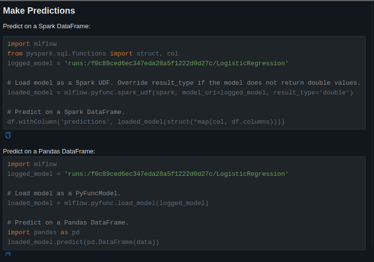

 mlflow run . --env-manager=local --experiment-name Loan_prediction

Other version of MLproject file

```yaml
name: example-project

# Using requirements.txt for environment setup
docker_env:
  image: python:3.8

entry_points:
  main:
    parameters:
      alpha: {type: float, default: 0.5}
      l1_ratio: {type: float, default: 0.1}
    command: "python train_flask.py --alpha {alpha} --l1_ratio {l1_ratio}"

```

MLproject file using conda environment

```yaml
name: example-project

conda_env: conda.yaml

entry_points:
  main:
    parameters:
      alpha: {type: float, default: 0.5}
      l1_ratio: {type: float, default: 0.1}
    command: "python train_flask.py --alpha {alpha} --l1_ratio {l1_ratio}"

```

## Prediction



```python
import mlflow
import pandas as pd

# Define the data
data = [[1.0, 0.0, 0.0, 0.0, 0.0, 4.85203026, 360.0, 1.0, 2.0, 8.67402599]]

# Define the column names
column_names = ['Gender', 'Married', 'Dependents', 'Education', 'Self_Employed', 'LoanAmount', 'Loan_Amount_Term', 'Credit_History', 'Property_Area', 'TotalIncome']

# Create the DataFrame
df = pd.DataFrame(data, columns=column_names)

logged_model = 'runs:/50e605fbbca1410c8ecedeb5e106b64f/RandomForestClassifier'
loaded_model = mlflow.pyfunc.load_model(logged_model)
loaded_model.predict(df)

```


https://github.com/mlflow/mlflow/discussions/5898

In order to leverage virtualenv support with MLflow, pyenv must be installed according to the instructions from: https://mlflow.org/docs/latest/models.html#environment-management-tools. pyenv installation instructions are available here: https://github.com/pyenv/pyenv#installation.

```bash
# To install pyenv:
curl https://pyenv.run | bash
python -m  pip install virtualenv

# Then add pyenv to the PATH
PATH="$HOME/.pyenv/bin:$PATH"
```


```
mlflow models serve -m /home/sanjeet/Desktop/git_pod_el/ml-ops-production/prediction_model/mlruns/639570088861013504/00bde6317ad3470796d45d654c5bc3fc/artifacts/LogisticRegression/ -p 1234 --no-conda
```

API:

```bash
curl -X POST \
     -H "Content-Type: application/json" \
     --data '{"dataframe_split": {"columns":["Gender","Married","Dependents","Education","Self_Employed","LoanAmount","Loan_Amount_Term","Credit_History","Property_Area","TotalIncome"],"data":[[1.0,0.0,0.0,0.0,0.0,4.85203026,360.0,1.0,2.0,8.67402599]]}}' \
     http://localhost:1234/invocations
```

Train command

```cmd
 python train.py –experiment-name Loan_prediction
 python train_doc.py –experiment-name Loan_prediction
 python train_api.py –experiment-name Loan_prediction
```


pydantic vs dataclass when to use.
Why it is named fast-api


```cmd
# FastAPI
 uvicorn loan_pred_app:app --reload
 
# Streamlit 
 streamlit run streamlit_app.py

# Flask
 export PORT=4500
 python /home/sanjeet/Desktop/git_pod_el/ml-ops-production/prediction_model/flask/app.py

```